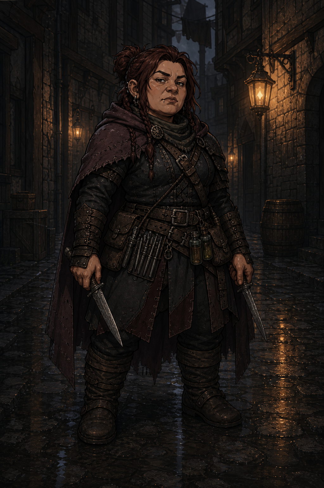

# Ombre

Elle volait aux riches pour survivre, ou pour le plaisir. Maintenant elle vole des secrets, des visages, des vies entières. Dans une société qui se croit civilisée, quelqu'un doit bien vivre dans les espaces entre les règles. Autant que ce soit elle.

## Sommaire

- [Profil](#profil)
- [Équipement de départ](#équipement-de-départ)
- [Capacités par niveau](#capacités-par-niveau)
- [Liens utiles](#liens-utiles)

## Profil

| Élément | Valeur |
| --- | --- |
| Dé de vie | d8 |
| Caractéristique principale | AGILITÉ |
| Maîtrises | Armes légères, armures légères uniquement |

## Équipement de départ

2 dagues, arbalète de poing + carreaux, armure légère, outils de voleur, 5 doses de poison.

Le poison ajoute +1d4 dégâts sur la cible lorsque l'arme est empoisonnée.

## Capacités par niveau

### Niveau 1

- **Coup sournois** : si l'Ombre attaque avec Avantage, double le nombre de dés de dégâts de l'arme (ex : d4 -> 2d4, d6 -> 2d6). Sur un 20 naturel lors d'un Coup sournois, les dés sont maximisés ET doublés.
- **Discrétion experte** : Avantage sur tous les jets de furtivité et déguisement. Peut tenter de se cacher même observée si une distraction existe.

## Liens utiles

- [Création de Personnage](../02%20-%20Création%20de%20Personnage.md)
- [Règles de Base](../01%20-%20Règles%20de%20Base.md)
- [Combat](../04%20-%20Combat.md)
- [Retour aux classes](../03%20-%20Classes.md)
