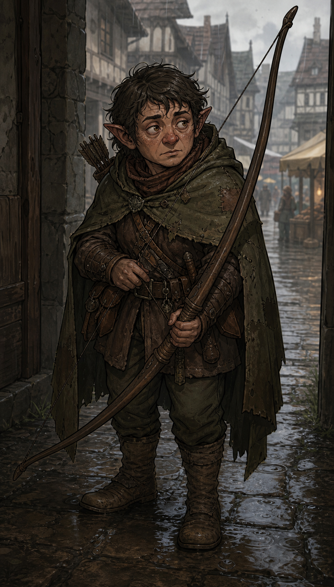

# Pisteur

On l'appelait quand une bête s'échappait, quand une piste se perdait dans la forêt. Maintenant on l'appelle pour autre chose. Les hommes sont devenus la seule proie qui reste.

## Sommaire

- [Profil](#profil)
- [Équipement de départ](#équipement-de-départ)
- [Capacités par niveau](#capacités-par-niveau)
- [Liens utiles](#liens-utiles)

## Profil

| Élément | Valeur |
| --- | --- |
| Dé de vie | d6 |
| Caractéristique principale | AGILITÉ |
| Maîtrises | Armes légères et à distance, armures légères et intermédiaires |

## Équipement de départ

Arc court et flèches, épée courte ou dague, armure légère.

## Capacités par niveau

### Niveau 1

- **Attaque surprise** : si la cible n'est pas consciente de votre présence au début du combat, double les dégâts de la première attaque du combat.
- **Favori du terrain** : en dehors d'une ville, Avantage sur tous les jets liés à la survie en milieu naturel. La stat utilisée dépend du contexte : AGI pour se déplacer sans être suivi ou échapper à un prédateur, ESP pour trouver de la nourriture, lire les traces ou s'orienter, FOR pour résister aux éléments. Le MJ choisit la stat selon la situation.

## Liens utiles

- [Création de Personnage](../02%20-%20Création%20de%20Personnage.md)
- [Règles de Base](../01%20-%20Règles%20de%20Base.md)
- [Combat](../04%20-%20Combat.md)
- [Retour aux classes](../03%20-%20Classes.md)
