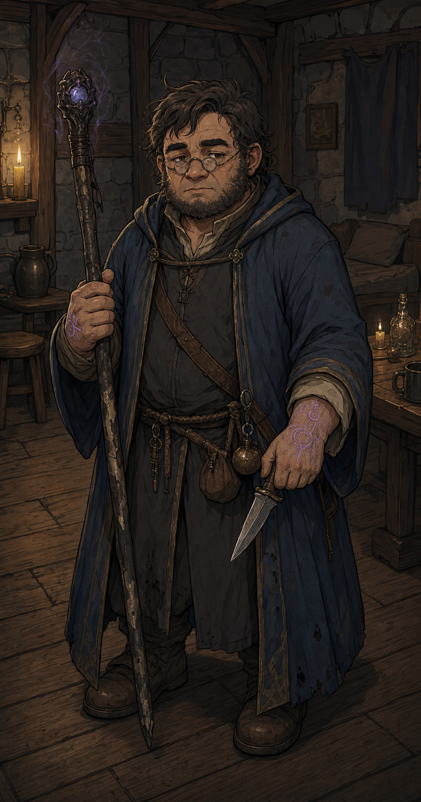

# Vestige

Fut une époque où les mages étaient rares mais respectés. Maintenant ils sont rares et craints. La magie qu'ils portent se voit, se sent, dérange. Lui n'a rien choisi de tout ça, ou peut-être que si.

## Sommaire

- [Profil](#profil)
- [Mana](#mana)
- [Équipement de départ](#équipement-de-départ)
- [Capacités par niveau](#capacités-par-niveau)
- [Liens utiles](#liens-utiles)

## Profil

| Élément | Valeur |
| --- | --- |
| Dé de vie | d6 |
| Caractéristique principale | ESPRIT |
| Maîtrises | Dague, épée courte, bâton. Aucune armure |

## Mana

**Mana de départ :** 8

À la création, le Vestige choisit son Domaine. Ce Domaine définit ce que sa magie peut faire.

## Équipement de départ

Bâton ou dague, robe ou équivalent sans armure.

## Capacités par niveau

### Niveau 1

- **Incantation** : peut tenter n'importe quel effet cadrant avec son Domaine. Dépense du mana selon la puissance voulue, dans la limite du plafond par niveau. Voir [Magie et Mana](../05%20-%20Magie%20et%20Mana.md).
- **Sens arcanique** : détecte passivement la présence de magie dans un rayon de 10 m. Peut identifier un objet ou effet magique avec 1 minute de concentration.

## Liens utiles

- [Création de Personnage](../02%20-%20Création%20de%20Personnage.md)
- [Magie et Mana](../05%20-%20Magie%20et%20Mana.md)
- [Montée de Niveau](../06%20-%20Montée%20de%20Niveau.md)
- [Retour aux classes](../03%20-%20Classes.md)
