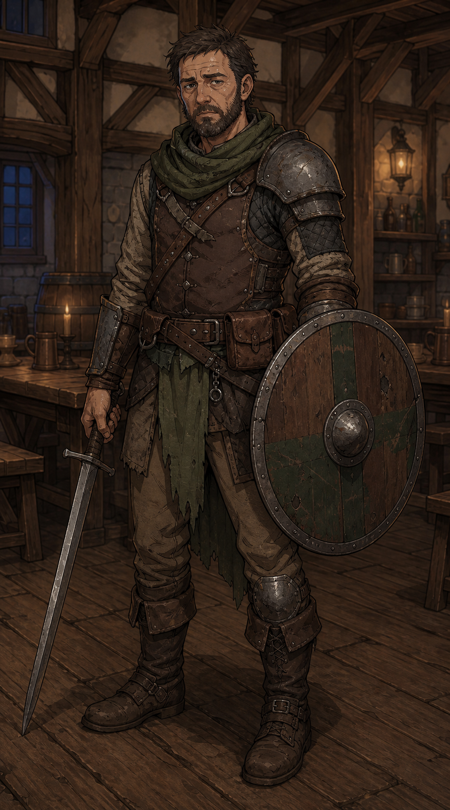

# Vétéran

On lui donnait des ordres. Il les exécutait. On l'envoyait là où ça saignait, il nettoyait. Et maintenant qu'il n'y a plus de guerre, juste des gens qui ont peur les uns des autres, on l'appelle encore.

## Sommaire

- [Profil](#profil)
- [Équipement de départ](#équipement-de-départ)
- [Capacités par niveau](#capacités-par-niveau)
- [Liens utiles](#liens-utiles)

## Profil

| Élément | Valeur |
| --- | --- |
| Dé de vie | d10 |
| Caractéristique principale | FORCE |
| Maîtrises | Toutes les armes, toutes les armures |

## Équipement de départ

Épée longue OU hache de bataille et bouclier, armure intermédiaire OU armure lourde.

## Capacités par niveau

### Niveau 1

- **Discipline de fer** : 1 fois par combat, peut relancer un jet d'attaque raté et garder le second résultat.
- **Résistance** : 1 fois par combat, ignore 3 points de dégâts d'une attaque.

## Liens utiles

- [Création de Personnage](../02%20-%20Création%20de%20Personnage.md)
- [Combat](../04%20-%20Combat.md)
- [Montée de Niveau](../06%20-%20Montée%20de%20Niveau.md)
- [Retour aux classes](../03%20-%20Classes.md)
